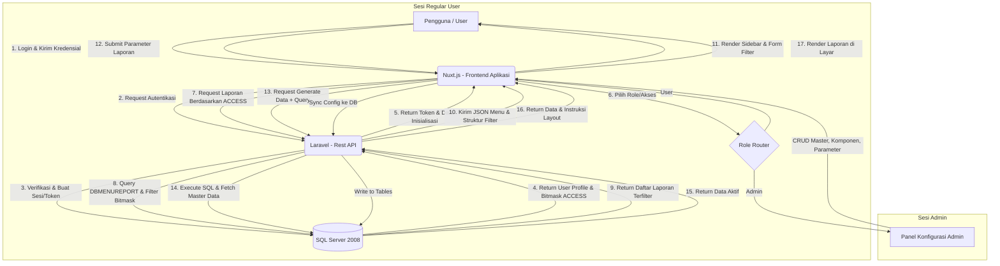
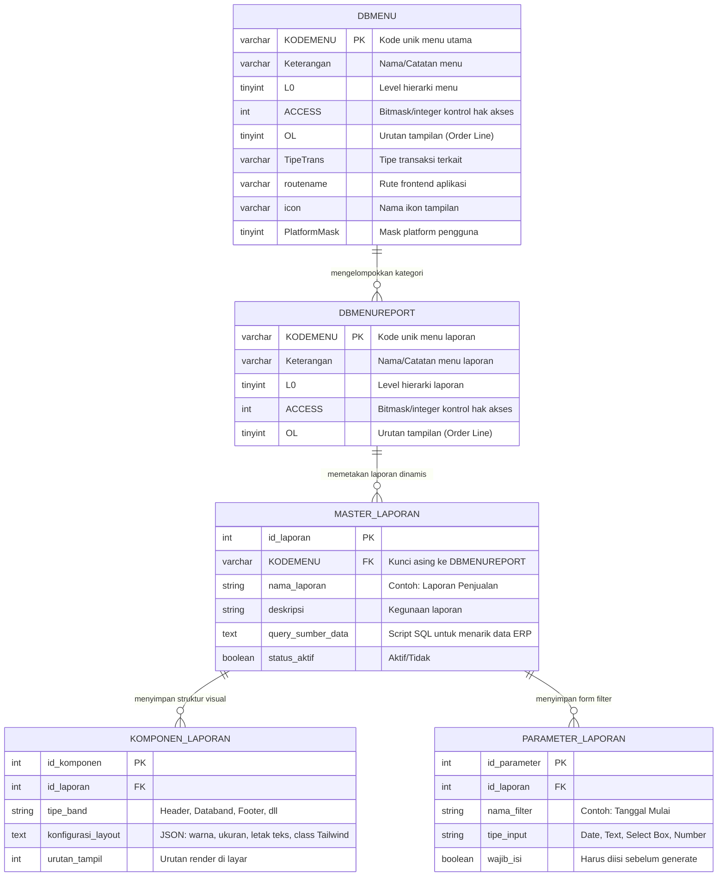

# PRD — Project Requirements Document

## 1. Overview
Dalam sistem Enterprise Resource Planning (ERP), pembuatan dan pengelolaan laporan seringkali menjadi hambatan karena membutuhkan waktu pengkodean yang lama untuk setiap variasi desain. Proyek ini bertujuan untuk menciptakan sebuah **Fitur Laporan & Form Dinamis (Dynamic Form/Report Engine)** yang menginspirasi *FastReport VCL*, namun disesuaikan dengan arsitektur web modern dan kebutuhan kontrol akses enterprise.

Sistem dirancang dengan pendekatan **Login-First & Role-Based**. Setelah autentikasi, setiap pengguna akan melihat **Sidebar Menu Personalisasi** yang hanya menampilkan laporan yang diizinkan berdasarkan hak akses (kolom `ACCESS`). Pengguna reguler cukup memasukkan filter parameter untuk menghasilkan laporan, sementara Administrator diberikan **Panel Konfigurasi** untuk mengatur struktur query, tata letak, komponen, dan parameter tanpa perlu menyentuh kode aplikasi (*No-Code/Low-Code*). Seluruh sistem tetap terintegrasi dengan database legacy Microsoft SQL Server 2008 dan mengikuti struktur otorisasi yang sudah berjalan.

## 2. Requirements
- **Autentikasi & Routing Berbasis Peran:** Sistem dimulai dengan halaman login. Setelah berhasil, backend mengidentifikasi role pengguna (Regular User / Admin) dan mengirimkan data inisialisasi yang sesuai.
- **Sidebar Menu Dinamis & Terprivilese:** Daftar laporan di sidebar kiri (atau navigasi utama) dihasilkan secara otomatis berdasarkan tabel `DBMENUREPORT`. Hanya laporan yang memenuhi kriteria bitwise/integer `ACCESS` pada sesi pengguna yang akan dirender.
- **Form Filter & Generasi Laporan:** Antarmuka pengguna menampilkan form input dinamis (tanggal, kategori, gudang, dll.) yang dikonfigurasi di database. Setelah submit, sistem menjalankan query, merakit komponen, dan menampilkan hasil.
- **Panel Konfigurasi Laporan (Khusus Admin):** Antarmuka dedikasi bagi Admin untuk membuat, mengedit, atau menghapus definisi laporan (`MASTER_LAPORAN`), menyusun visualisasi (`KOMPONEN_LAPORAN`), dan mengatur parameter input (`PARAMETER_LAPORAN`) secara real-time.
- **Driven by Database & Minimum Coding:** Semua desain layout, query sumber data, dan form filter disimpan sebagai konfigurasi di database. Perubahan dilakukan oleh Admin via UI, langsung berdampak tanpa deployment ulang.
- **Kompatibilitas Legacy & Integrasi ERP:** Backend wajib berkomunikasi secara efisien dengan Microsoft SQL Server 2008 menggunakan driver database yang sesuai, serta mematuhi struktur kolom `ACCESS`, `KODEMENU`, dan hierarki `L0` yang sudah ada.

## 3. Core Features
- **Autentikasi & Manajemen Sesi:** Halaman login terintegrasi dengan sistem keamanan ERP. Setelah login, sistem membangun session/token yang memuat ID pengguna, role, dan bitmask `ACCESS` untuk evaluasi hak laporan secara real-time.
- **Sidebar Menu Personalisasi:** Navigasi utama di sisi kiri layar secara dinamis memuat daftar laporan yang diizinkan. Tidak ada laporan yang disembunyikan atau ditampilkan secara statis; seluruhnya dihitung dari relasi `KODEMENU` dan nilai `ACCESS` user yang sedang aktif.
- **Antarmuka Filter Dinamis:** Sebelum laporan digenerate, sistem menampilkan form filter yang strukturnya ditarik dari `PARAMETER_LAPORAN`. Form ini bersifat reaktif dan menyesuaikan tipe input (date picker, dropdown, text, toggle) sesuai konfigurasi.
- **Mesin Generator Form & Laporan:** Inti sistem yang membaca instruksi dari `KOMPONEN_LAPORAN` (Header, Databand, Footer, styling via Tailwind/CSS classes), mengeksekusi `query_sumber_data` dengan parameter yang telah diisi, dan menyusun tampilan akhir di layar atau menyiapkan file untuk export/print.
- **Panel Konfigurasi Laporan (Khusus Admin):** Dashboard khusus Administrator untuk:
  - CRUD `MASTER_LAPORAN` (nama, deskripsi, query SQL, status aktif).
  - CRUD `KOMPONEN_LAPORAN` (mengatur urutan band, posisi elemen, warna, ukuran font, alignment) melalui **Editor Visual/No-Code**: Antarmuka drag-and-drop atau schema-based yang secara otomatis menyusun dan menyusun ulang struktur layout tanpa perlu menyentuh kode aplikasi.
  - CRUD `PARAMETER_LAPORAN` (menambah/menghapus filter yang muncul di sisi user).
  - Mapping akses laporan ke role/user tertentu.
- **Integrasi Hak Akses ERP:** Sistem otorisasi memanfaatkan struktur tabel legacy (`DBMENU` & `DBMENUREPORT`). Logika akses dilakukan melalui evaluasi kolom `ACCESS` (bitwise/integer mapping) yang disinkronkan dengan profil login pengguna, menjamin kepatuhan keamanan enterprise.

## 4. User Flow
1. **Login & Autentikasi:** Pengguna membuka halaman login, memasukkan kredensial. Backend memverifikasi, membuat session, dan menyimpan profil pengguna (termasuk role dan nilai `ACCESS`).
2. **Inisialisasi & Render Sidebar:** 
   - **Jika Regular User:** Backend melakukan query ke `DBMENUREPORT`, mengevaluasi nilai `ACCESS` berdasarkan role user, memfilter laporan yang valid, dan mengirimkan daftar menu ter-filter ke Frontend. Frontend merender Sidebar Menu Personalisasi.
   - **Jika Admin:** Sidebar menampilkan tambahan menu "Konfigurasi Laporan" di samping laporan standar. Admin juga memiliki akses penuh ke panel pengaturan.
3. **Skenario Regular User (Menggunakan Laporan):**
   - User mengklik laporan di sidebar (misal: "Laporan Penjualan Harian").
   - Frontend meminta struktur filter dari `PARAMETER_LAPORAN` dan menampilkan **Form Filter Dinamis**.
   - User mengisi parameter (misal: `2023-10-01` s/d `2023-10-03`, Gudang: `GDK-JKT`), lalu menekan "Generate".
   - Backend mengeksekusi query dari `MASTER_LAPORAN` dengan parameter yang disuntikkan, menarik data dari SQL Server 2008.
   - Mesin render menyusun Header, mengisi Databand dengan data, menutup Footer, dan menampilkan hasil di area utama. User dapat mencetak atau mengunduh.
4. **Skenario Admin (Mengelola Laporan):**
   - Admin membuka Panel Konfigurasi.
   - Admin memilih laporan untuk diedit, mengubah query SQL (`query_sumber_data`), menambah/menghapus kolom tampilan di `KOMPONEN_LAPORAN`, atau menyesuaikan filter di `PARAMETER_LAPORAN`.
   - Admin menekan "Simpan". Perubahan langsung tercatat di database. Saat user biasa membuka laporan tersebut, perubahan layout/struktur akan langsung terlihat tanpa perlu restart aplikasi.
5. **Logout & Pembatalan Sesi:** User mengakhiri sesi. Token diinvalidate. Akses ke laporan dibatalkan hingga login ulang.

## 5. Architecture
Arsitektur menggunakan pola Client-Server yang memisahkan rendering dinamis di Frontend dan logika bisnis/otorisasi di Backend. Autentikasi menjadi pintu gerbang pertama yang menentukan scope data dan menu yang dapat dikonsumsi oleh sesi tersebut.



## 6. Database Schema
Sistem tidak membuat tabel fisik per laporan. Sebagai gantinya, digunakan tabel "Blueprint" yang menyimpan cetak biru setiap laporan operasional. Struktur ini berinteraksi langsung dengan tabel manajemen menu enterprise (`DBMENU` & `DBMENUREPORT`) yang telah disediakan.



**Struktur JSON pada `konfigurasi_layout`:**
Kolom `konfigurasi_layout` pada tabel `KOMPONEN_LAPORAN` menyimpan definisi visual lengkap dalam format JSON. Struktur ini dirancang agar dapat diparsing secara reaktif oleh frontend tanpa kompromi performa. Contoh konkretnya adalah sebagai berikut:

```json
{
  "band": "databand",
  "position": {
    "x": 0,
    "y": 120,
    "width": "100%",
    "height": "auto"
  },
  "style": {
    "fontSize": "14px",
    "fontWeight": "medium",
    "textAlign": "left",
    "color": "#334155",
    "backgroundColor": "#ffffff",
    "tailwindClasses": "px-4 py-2 border-b border-gray-200 hover:bg-gray-50"
  },
  "dataBinding": [
    {
      "sourceColumn": "TRX_DATE",
      "displayLabel": "Tanggal Transaksi",
      "renderType": "text",
      "format": "dd/MM/yyyy",
      "alignment": "center"
    },
    {
      "sourceColumn": "ITEM_CODE",
      "displayLabel": "Kode Barang",
      "renderType": "text",
      "format": "none",
      "alignment": "left"
    },
    {
      "sourceColumn": "QTY",
      "displayLabel": "Quantity",
      "renderType": "number",
      "format": "decimal(2)",
      "alignment": "right"
    }
  ]
}
```

**Komposisi JSON:**
- **Band Properties:** Properti `"band"` menentukan konteks render (`header`, `databand`/body, `footer`, `groupheader`, `groupfooter`). Ini mengarahkan bagaimana mesin template memproses iterasi data.
- **Element Positioning:** Objek `"position"` mengatur tata letak absolut/relatif (`x`, `y`) dan dimensi responsif (`width`, `height`).
- **Styling:** Objek `"style"` menggabungkan properti CSS standar dengan string/array class Tailwind (`tailwindClasses`), memungkinkan styling dinamis yang konsisten dengan framework CSS yang dipakai.
- **Data Binding:** Array `"dataBinding"` memetakan kolom hasil query SQL (`sourceColumn`) ke elemen tampilan. Atribut seperti `format`, `renderType`, dan `alignment` memungkinkan transformasi data secara client-side sebelum dirender.

**Penjelasan Teknis & Evaluasi ACCESS:**
1. **`DBMENU` & `DBMENUREPORT`**: Tabel referensi legacy yang sudah ada. Kolom `ACCESS` bertipe `int` berfungsi sebagai bitmask atau integer kontrol. Backend Laravel akan melakukan operasi bitwise (`&`) antara nilai `ACCESS` pada laporan dengan profil hak akses user yang sedang login. Hanya laporan yang menghasilkan nilai `> 0` (match) yang akan disertakan dalam payload sidebar.
2. **`MASTER_LAPORAN`**: Pusat definisi logika data. Kolom `KODEMENU` mengikat laporan secara eksplisit ke izin akses di `DBMENUREPORT`. Admin dapat mengubah `query_sumber_data` untuk menyesuaikan sumber data ERP tanpa mengubah kode backend.
3. **`KOMPONEN_LAPORAN`**: Penyimpan instruksi visual menggunakan struktur JSON yang telah dijelaskan di atas. Frontend Nuxt.js membaca JSON ini dan menerapkan class CSS/tata letak secara reaktif sesuai spesifikasi band, posisi, style, dan binding data.
4. **`PARAMETER_LAPORAN`**: Mengatur form filter dinamis. Kolom `wajib_isi` memungkinkan sistem memvalidasi input user sebelum query dijalankan. Ini memastikan data yang ditarik selalu sesuai konteks bisnis.
5. **Integrasi Sesi Login**: Sistem tidak membutuhkan tabel user tambahan khusus untuk fitur ini. Validasi hak akses dilakukan real-time saat request API masuk. Session/Token mengikat `USER_ID` ke role dan nilai akses, sehingga setiap kali sidebar atau form filter diminta, backend melakukan join/eval terhadap `DBMENUREPORT.ACCESS` secara instan.

## 7. Tech Stack
Teknologi dipilih untuk memastikan responsivitas antarmuka, keamanan akses, dan kompatibilitas penuh dengan database legacy SQL Server 2008.

- **Frontend:** **Nuxt.js 3 (Vue 3)** dengan **Tailwind CSS**. Nuxt.js mengelola state management, routing dinamis, dan rendering komponen form/laporan berbasis JSON. Tailwind CSS memastikan styling yang konsisten dan mudah dikonfigurasi via string class yang dikirim dari database. **Catatan Teknis Rendering:** Nuxt.js dilengkapi dengan *Dynamic Template Engine* yang secara khusus memaksimalkan JSON dari `KOMPONEN_LAPORAN`. Engine ini melakukan parsing pada properti `style` dan `tailwindClasses` untuk mengikat class CSS secara reaktif ke elemen DOM. Proses ini memungkinkan perubahan layout, typography, dan posisi elemen diterapkan secara instan di sisi klien tanpa perlu recompilasi paket frontend atau deployment ulang.
- **Backend:** **Laravel (PHP 8+)**. Bertugas sebagai API Gateway dan business logic processor. Laravel menangani autentikasi JWT/Session, evaluasi bitmask `ACCESS`, sanitasi input parameter, eksekusi raw query dinamis yang aman (prepared statements), dan pengiriman payload terstruktur.
- **Database:** **Microsoft SQL Server 2008**. Database inti perusahaan. Sistem menggunakan driver PDO `sqlsrv` atau `sqlsrv` via ODBC untuk membaca tabel `DBMENU`, `DBMENUREPORT`, serta seluruh tabel transaksi ERP yang direferensi oleh `MASTER_LAPORAN.query_sumber_data`.
- **Deployment & Infrastruktur:** **VPS (Linux/Ubuntu)** dengan **Nginx**. Nginx meny serve frontend (Nuxt SSR/Static) dan reverse proxy ke Laravel API. Koneksi database diamankan melalui firewall internal (VPN/private network) untuk mengakses SQL Server 2008 yang on-premise. Manajemen sesi menggunakan HttpOnly Cookies atau JWT pendek untuk keamanan akses laporan.